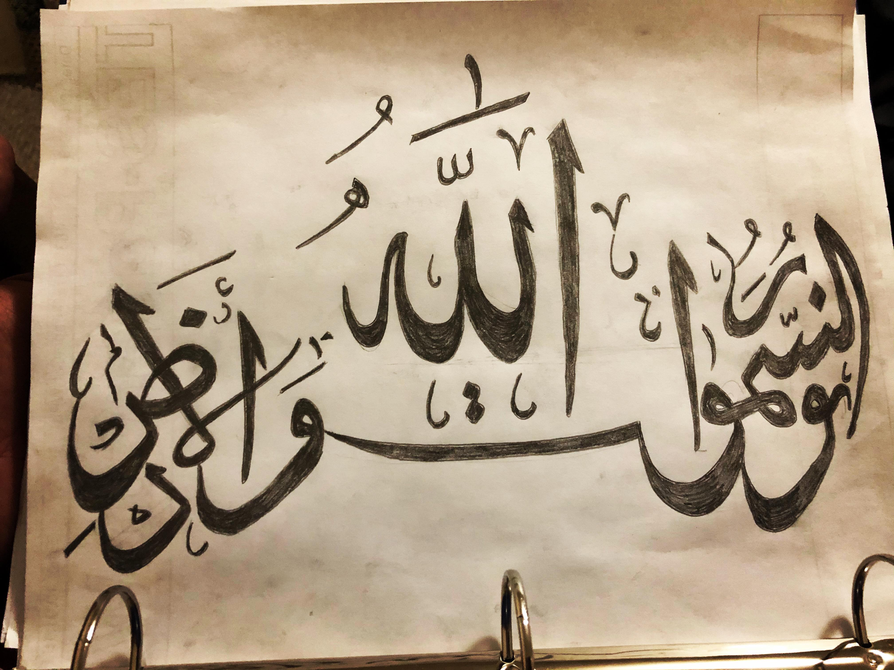
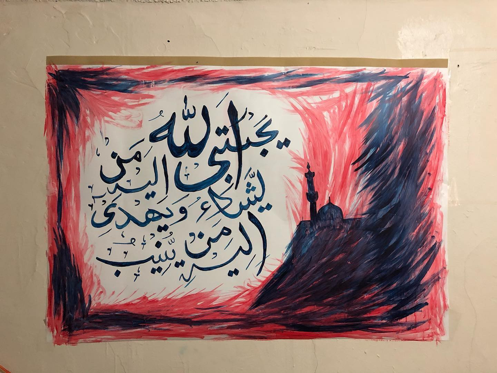
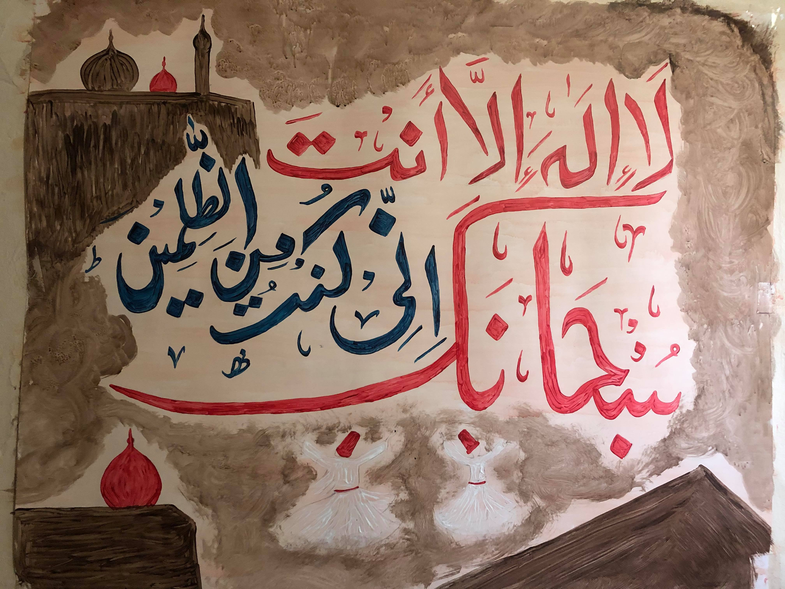
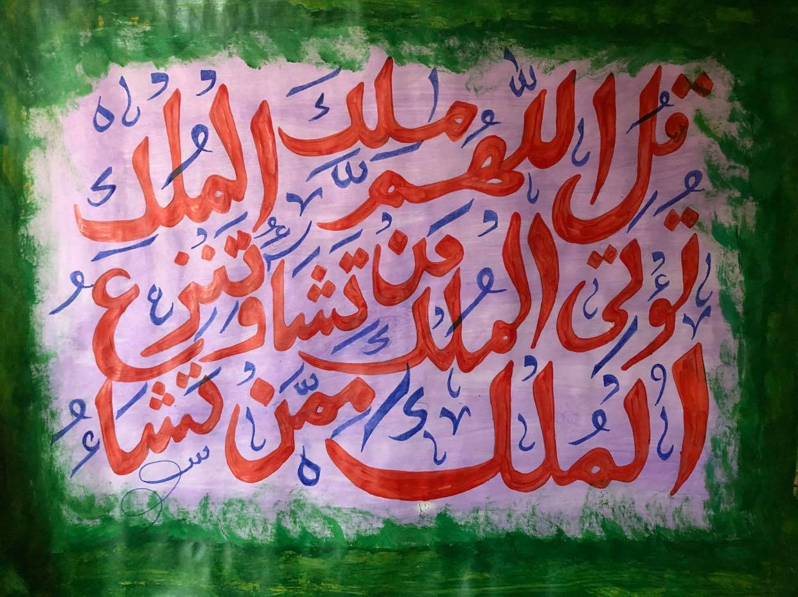
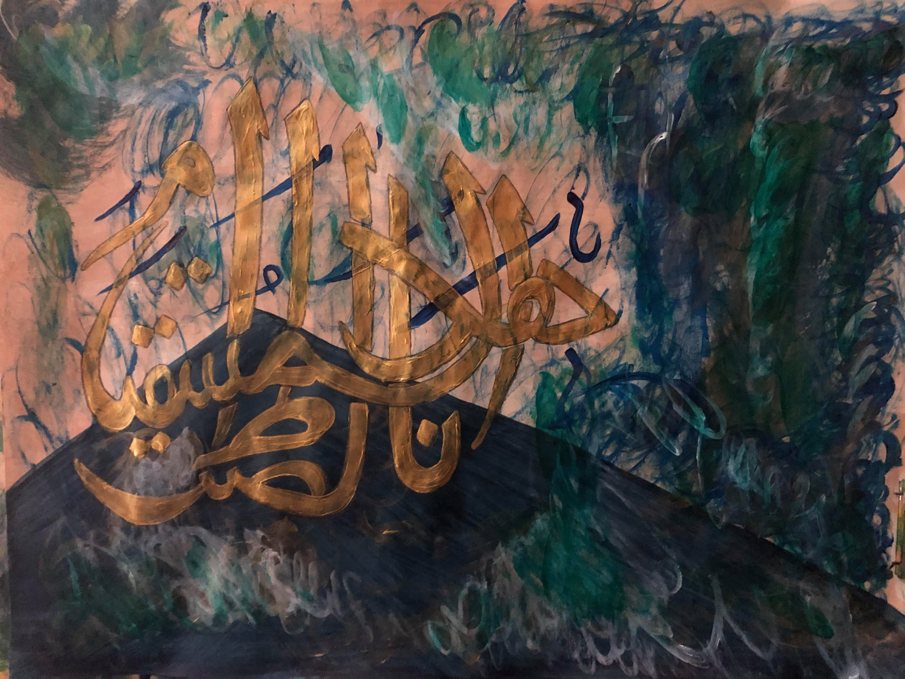

## Hobbies

## Reading Recommendations
Please visit my [goodreads](https://www.goodreads.com/user/show/126347827-husnain-mubarik) account.

## Cardistry
Cardistry is "the performance art of card flourishing" -- cardistry is about spinning, tossing, cutting, and otherwise manipulating cards - up, down, sideways, and around, and however else you can - in order to create an aesthetically pleasing display.
Read more about cardistry [here](https://playingcarddecks.com/blogs/all-in/what-is-cardistry)

## Calligraphy 

|------------|
|   | 
|------------|
| [24:35]      |
|------------|
|   | 
|------------|
| [42:13]      |
|------------|
|   | 
|------------|
| [21:87]      |
|------------|
|   | 
|------------|
| [3:26]      |
|------------|
|   | 
|------------|
| [1:5]      |
|------------|

