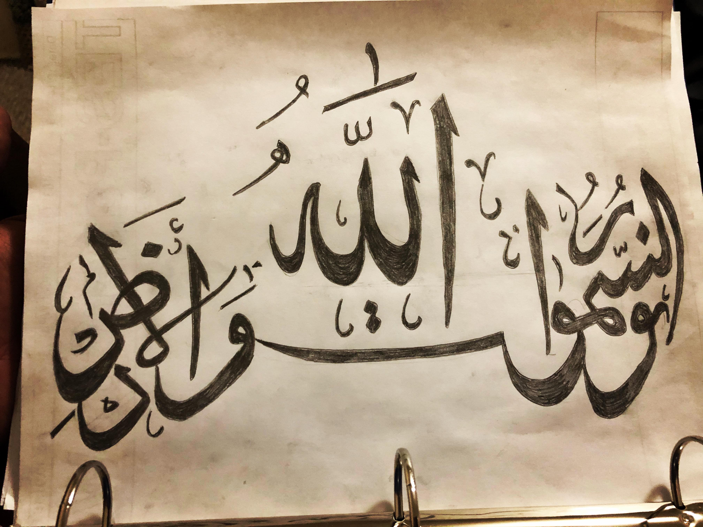
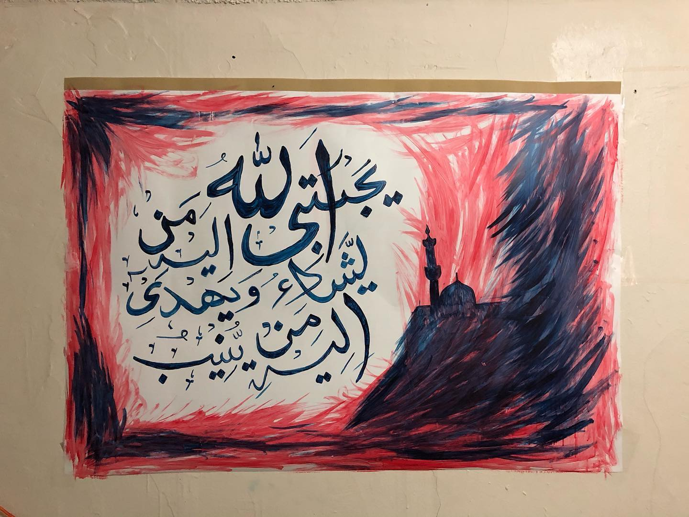
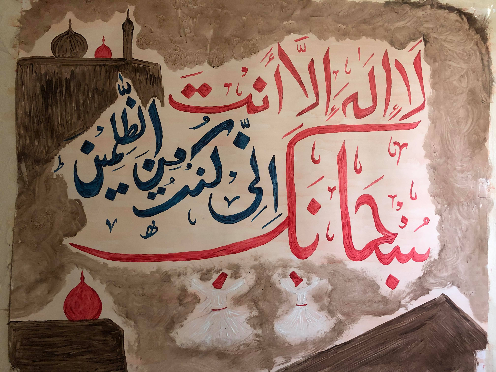
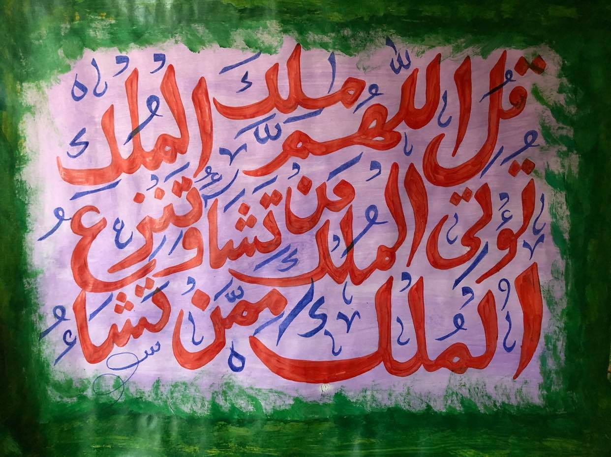
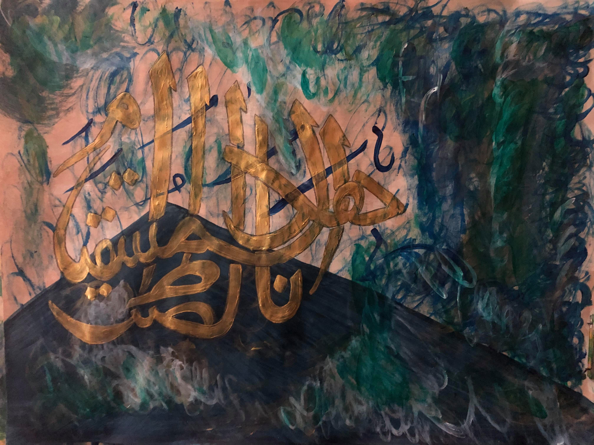

Beyond my professional work in computer architecture and graphics, I enjoy pursuing creative and intellectual interests that provide balance and inspiration.

---

## 📚 Book Reading

I'm an avid reader with interests spanning fiction, non-fiction, philosophy, and technical literature. Reading helps me explore new ideas and perspectives beyond my research domain.

**Reading Recommendations:** Visit my [Goodreads profile](https://www.goodreads.com/user/show/126347827-husnain-mubarik) for book reviews and recommendations.

---

## 🎴 Cardistry

Cardistry is "the performance art of card flourishing" – the art of spinning, tossing, cutting, and manipulating cards in aesthetically pleasing ways. It combines dexterity, creativity, and visual appeal.

This hobby helps develop:
- Fine motor skills and hand-eye coordination
- Patience and attention to detail
- Creative expression through movement

Learn more about cardistry [here](https://playingcarddecks.com/blogs/all-in/what-is-cardistry).

---

## ✍️ Islamic Calligraphy

I practice Islamic calligraphy, focusing on Quranic verses and traditional Arabic script. This art form connects spirituality with aesthetics, requiring precision, patience, and deep respect for the sacred text.

### Gallery

  
  
Quranic Verse 24:35 - Ayat an-Nur (The Light Verse)

  
  
Surah 42:13 - Consultation and Unity

  
  
Quranic Verse 21:87 - Dhikr (Remembrance)

  
  
Surah 3:26 - Sovereignty belongs to Allah

  
  
Surah 1:5 - Iyyaka Na'budu (You alone we worship)

---

## 🎨 Why These Hobbies Matter

These pursuits complement my technical work by:
- **Calligraphy:** Develops precision, patience, and attention to detail – qualities essential in research
- **Cardistry:** Enhances creativity and problem-solving through physical expression
- **Reading:** Broadens perspectives and maintains intellectual curiosity

The intersection of art, technology, and intellectual exploration keeps me balanced and inspired in both professional and personal life.

---

*"The best way to predict the future is to create it, but the best way to understand the present is to appreciate its beauty."*
